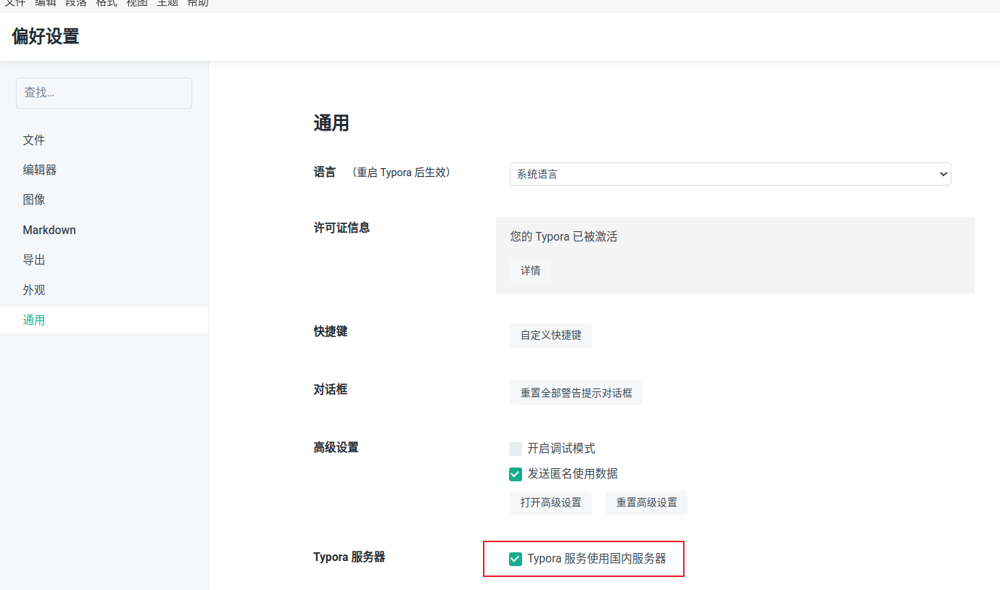

### typoral

> 在Ubuntu下使用cargo破解Typoral

#### :one: 克隆仓库

```bash
# 我把可以成功破解的版本1.9.3放在了app目录下
git clone https://github.com/Airporal/MarkDownApp.git
```

#### :two:配置Rust

由于编译项目需要 **Rust** 的支持，所以我们需要配置相关环境(若已有，则可跳过该步骤)

```bash
# 运行官方脚本安装即可
curl --proto '=https' --tlsv1.2 -sSf https://sh.rustup.rs | sh

# 检查 cargo，若看到如下版本信息，则说明配置成功
cargo -V
cargo 1.70.0 (ec8a8a0ca 2023-04-25)
```

#### :three: 编译 Yporaject 项目

```bash
# 进入 Yporaject 项目
cd Yporaject
# 运行编译命令
cargo build
# 查看二进制是否生成,程序名称为 node_inject
ls target/debug
# 尝试运行该二进制程序
cargo run
output: 
no node_modules.asar found
move me to the root of your typora installation(the same directory as executable of electron)
```

请务必确认当前项目目录 **target/debug 下** 是否生成了 **node_inject 二进制程序**

#### :four:复制二进制程序到安装目录下

```bash
# 记录当前目录路径，待会返回需要用到
cur=`pwd`
# 复制二进制程序到相关目录下
sudo cp target/debug/node_inject /usr/share/typora
# 进入相关目录
cd /usr/share/typora
# 给予二进制程序执行权限
sudo chmod +x node_inject
# 运行二进制程序
# (请注意程序运行输出信息，观察是否运行成功！！)
# 若无读写权限,建议使用 sudo ./node_inject
sudo ./node_inject
```

#### :five:生成许可证

```bash
# 返回项目
cd $cur
# 进入 license-gen 文件夹
cd license-gen
# 编译代码
cargo build
# 运行二进制程序
cargo run
# 你将会得到以下输出
output:
    Finished dev [unoptimized + debuginfo] target(s) in 0.00s
     Running `target/debug/license-gen`
License for you: xxxxxx-xxxxxx-xxxxxx-xxxxxx
```

复制 **License for you: xxxxxx-xxxxxx-xxxxxx-xxxxxx** 的那一串激发码，待会需要用到。

#### :six:激活软件

选择国内服务器：文件->偏好设置->通用->Typoral服务器

依次点击界面上方菜单栏选项 **help > my license(帮助 > 我的许可证...)** 

邮箱可以随便填。

然后在第二输入框中，**粘贴刚才得到的激发码**即可成功激活。